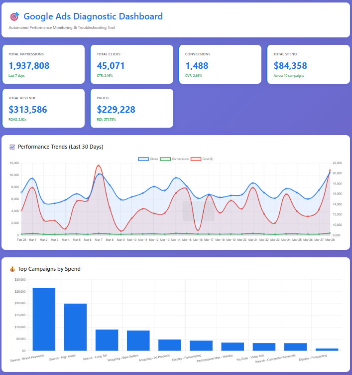

# 🎯 Google Ads Diagnostic & Analytics Platform

> **Automated performance monitoring, root cause analysis, and troubleshooting tool for Google Ads campaigns**



[](https://www.python.org/downloads/)
[](https://fastapi.tiangolo.com/)
[](LICENSE)

---

## 📋 **Table of Contents**
- [Overview](#overview)
- [Key Features](#key-features)
- [Tech Stack](#tech-stack)
- [Architecture](#architecture)
- [Installation](#installation)
- [Usage](#usage)
- [API Documentation](#api-documentation)
- [SQL Analytics](#sql-analytics)
- [Screenshots](#screenshots)
- [Skills Demonstrated](#skills-demonstrated)
- [Future Enhancements](#future-enhancements)
- [Author](#author)

---

## 🎯 **Overview**

This project is a **production-ready diagnostic tool** designed to help Product Support Engineers and Account Managers monitor Google Ads campaign performance, automatically identify issues, and provide actionable troubleshooting recommendations.

The system simulates real-world Google Ads workflows including:
- Real-time performance monitoring
- Automated anomaly detection
- SQL-based root cause analysis
- Customer-facing analytics dashboards
- Issue prioritization and remediation workflows

**Built to demonstrate skills aligned with Google's gTech Ads Product Support Engineer role.**

---

## ✨ **Key Features**

### **📊 Performance Monitoring**
- Real-time dashboard with 10+ key metrics (CTR, ROAS, Conversions, Spend)
- 30-day trend analysis with interactive visualizations
- Campaign-level performance breakdown
- Profit/ROI calculations

### **🔍 Automated Diagnostics**
- **Low CTR Detection**: Identifies campaigns with click-through rates below 1.5%
- **Poor ROAS Analysis**: Flags campaigns with return on ad spend below 2.0x
- **Conversion Issues**: Detects low conversion rates and zero-conversion high-spend campaigns
- **Severity Prioritization**: Critical, High, Medium issue classification

### **💡 Actionable Recommendations**
- Specific troubleshooting steps for each issue type
- Root cause analysis based on metric patterns
- Impact quantification (lost impressions, wasted spend)
- Best practice remediation guidance

### **📈 Advanced Analytics**
- SQL-based aggregation and time-series analysis
- Cross-campaign performance comparisons
- Trend identification (weekend effects, seasonal patterns)
- Custom metric calculations

---

## 🛠️**Tech Stack**

### **Backend**
- **FastAPI** - High-performance REST API framework
- **Python 3.8+** - Core programming language
- **Pandas** - Data manipulation and analysis
- **SQLite** - Lightweight relational database
- **Uvicorn** - ASGI server

### **Frontend**
- **HTML5/CSS3** - Responsive UI design
- **JavaScript (ES6+)** - Client-side logic
- **Chart.js** - Interactive data visualizations
- **Fetch API** - Asynchronous data loading

### **Data & SQL**
- **SQL** - Complex queries with aggregations, joins, window functions
- **SQLite** - Campaign performance data storage
- **Pandas** - Data generation and transformation

---

## 🏗️ **Architecture**
```
┌─────────────────────────────────────────────────────────────┐
│                     Frontend Dashboard                       │
│  (HTML/CSS/JS + Chart.js for visualizations)                │
└─────────────────────┬───────────────────────────────────────┘
                      │ HTTP/REST API
                      ▼
┌─────────────────────────────────────────────────────────────┐
│                   FastAPI Backend                            │
│  ┌──────────────────────────────────────────────────────┐  │
│  │  Endpoints:                                           │  │
│  │  • /api/dashboard - Metrics aggregation              │  │
│  │  • /api/diagnostics - Issue detection                │  │
│  │  • /api/trends - Time-series analysis                │  │
│  │  • /api/campaigns/performance - Campaign breakdown   │  │
│  └──────────────────────────────────────────────────────┘  │
└─────────────────────┬───────────────────────────────────────┘
                      │ SQL Queries
                      ▼
┌─────────────────────────────────────────────────────────────┐
│                   SQLite Database                            │
│  ┌──────────────────────────────────────────────────────┐  │
│  │  Tables:                                              │  │
│  │  • campaigns - Daily performance metrics              │  │
│  │  • campaign_summary - Aggregated stats                │  │
│  └──────────────────────────────────────────────────────┘  │
└─────────────────────────────────────────────────────────────┘
```

---

## 🚀 **Installation**

### **Prerequisites**
- Python 3.8 or higher
- pip (Python package manager)
- Git

### **Step 1: Clone Repository**
```bash
git clone https://github.com/Srinivas-Jatothu/google-ads-diagnostic-tool.git
cd google-ads-diagnostic-tool
```

### **Step 2: Set Up Virtual Environment**
```bash
# Windows
python -m venv venv
venv\Scripts\activate

# Mac/Linux
python3 -m venv venv
source venv/bin/activate
```

### **Step 3: Install Dependencies**
```bash
cd backend
pip install -r requirements.txt
```

### **Step 4: Generate Sample Data**
```bash
python data_generator.py
```

**Output:**
```
🔄 Generating campaign data...
✅ Generated 310 rows of campaign data
✅ Date range: 2026-02-26 to 2026-03-28
✅ Campaigns: 10
✅ Database saved to: ads_data.db
```

---

## 📖 **Usage**

### **Start the Backend Server**
```bash
cd backend
python main.py
```

**Server starts at:** `http://localhost:8000`

### **Access the Dashboard**
1. Open `frontend/index.html` in your browser
2. Dashboard automatically loads campaign data
3. Auto-refreshes every 30 seconds

### **Explore API Documentation**
Visit: **http://localhost:8000/docs**

Interactive Swagger UI with all endpoints documented.

---

## 🔌 **API Documentation**

### **Core Endpoints**

#### **GET /api/dashboard**
Returns aggregated metrics for last 7 days
```json
{
  "total_impressions": 1937808,
  "total_clicks": 45071,
  "total_conversions": 1488,
  "total_cost": 84358.12,
  "total_revenue": 313586.45,
  "avg_ctr": 2.16,
  "avg_roas": 3.72,
  "profit": 229228.33,
  "roi_percentage": 271.73
}
```

#### **GET /api/diagnostics**
Runs automated issue detection
```json
{
  "total_issues": 8,
  "critical": 3,
  "high": 2,
  "medium": 3,
  "issues": [
    {
      "campaign_id": "camp_004",
      "campaign_name": "Search - Competitor Keywords",
      "issue_type": "Low Click-Through Rate",
      "severity": "High",
      "metric_value": "0.87%",
      "threshold": "1.5%",
      "recommendation": "Review ad copy relevance and targeting...",
      "impact": "152,340 impressions with only 1,325 clicks"
    }
  ]
}
```

#### **GET /api/trends**
Returns 30-day performance trends
```json
[
  {
    "date": "2026-03-01",
    "impressions": 65432,
    "clicks": 1543,
    "conversions": 52,
    "cost": 2847.23,
    "revenue": 10543.12
  }
]
```

#### **GET /api/campaigns/performance**
Top 10 campaigns by spend
```json
[
  {
    "campaign_id": "camp_001",
    "campaign_name": "Search - Brand Keywords",
    "impressions": 287543,
    "clicks": 8234,
    "conversions": 423,
    "avg_ctr": 2.86,
    "avg_roas": 4.52,
    "total_cost": 18543.21,
    "total_revenue": 83834.12
  }
]
```

---

## 📊 **SQL Analytics**

The project includes advanced SQL queries demonstrating:

### **Campaign Performance Analysis**
```sql
SELECT 
    campaign_id,
    campaign_name,
    SUM(impressions) as total_impressions,
    SUM(clicks) as total_clicks,
    ROUND(AVG(ctr), 2) as avg_ctr,
    ROUND(SUM(revenue) / SUM(cost), 2) as roas,
    SUM(cost) as total_spend
FROM campaigns
WHERE date >= date('now', '-30 days')
GROUP BY campaign_id, campaign_name
ORDER BY total_spend DESC;
```

### **Root Cause Diagnosis**
```sql
SELECT 
    campaign_id,
    campaign_name,
    AVG(ctr) as avg_ctr,
    AVG(roas) as avg_roas,
    CASE 
        WHEN AVG(ctr) < 1.0 THEN 'Low CTR - Check Ad Relevance'
        WHEN AVG(roas) < 2.0 THEN 'Low ROAS - Reduce Bids'
        ELSE 'Healthy'
    END as diagnosis
FROM campaigns
WHERE date >= date('now', '-7 days')
GROUP BY campaign_id, campaign_name
HAVING AVG(ctr) < 1.5 OR AVG(roas) < 2.0;
```

### **Trend Analysis with Window Functions**
```sql
SELECT 
    date,
    campaign_id,
    clicks,
    LAG(clicks, 1) OVER (PARTITION BY campaign_id ORDER BY date) as prev_day_clicks,
    ROUND(
        (clicks - LAG(clicks, 1) OVER (PARTITION BY campaign_id ORDER BY date)) * 100.0 / 
        LAG(clicks, 1) OVER (PARTITION BY campaign_id ORDER BY date), 
        2
    ) as pct_change
FROM campaigns
ORDER BY campaign_id, date DESC;
```

See `sql/analytics_queries.sql` for complete query examples.


---

## 🎓 **Skills Demonstrated**

This project showcases technical skills directly aligned with **Google's Product Support Engineer role**:

### **✅ Data Analysis & SQL**
- Complex SQL queries with aggregations, JOINs, and window functions
- Data pipeline design and ETL workflows
- Performance metric calculations (CTR, ROAS, CVR)
- Root cause analysis using data patterns

### **✅ Web Technologies & APIs**
- RESTful API design with FastAPI
- Asynchronous data fetching
- CORS configuration for cross-origin requests
- Interactive frontend with Chart.js visualizations

### **✅ Technical Troubleshooting**
- Automated diagnostic rule engines
- Issue severity classification
- Systematic debugging workflows
- Actionable recommendation generation

### **✅ Customer Support Workflows**
- Customer-facing dashboard design
- Clear, non-technical communication in recommendations
- End-to-end issue resolution tracking
- Proactive monitoring and alerting

### **✅ Product & System Understanding**
- Google Ads metrics and campaign structure
- Performance Max concepts
- Digital advertising best practices
- Analytics and reporting workflows

---

## 🔮 **Future Enhancements**

- [ ] **Google Ads API Integration** - Connect to real campaign data
- [ ] **Machine Learning Models** - Predictive analytics for campaign performance
- [ ] **Real-time Alerting** - Slack/Email notifications for critical issues
- [ ] **Multi-account Management** - Support for multiple advertiser accounts
- [ ] **Historical Comparison** - Week-over-week, month-over-month analysis
- [ ] **Export Functionality** - PDF reports and CSV data exports
- [ ] **Authentication & Authorization** - User login and role-based access
- [ ] **Deployment** - Docker containerization and cloud hosting (AWS/GCP)

---

## 👨‍💻 **Author**

**Jatothu Srinivas Nayak**  
Dual Degree (B.Tech + M.Tech) in Computer Science  
Indian Institute of Technology (IIT) Tirupati

- 📧 Email: jsrinivasnayak194@gmail.com
- 🔗 LinkedIn: [Srinivas-Jatothu](https://linkedin.com/in/Srinivas-Jatothu)
- 💻 GitHub: [Srinivas-Jatothu](https://github.com/Srinivas-Jatothu)
- 📱 Phone: +91-8143744824

---

## 📄 **License**

This project is open source and available under the [MIT License](LICENSE).

---

## 🙏 **Acknowledgments**

- Built as a portfolio project to demonstrate Product Support Engineering skills
- Inspired by real-world Google Ads support workflows
- Data is synthetically generated for demonstration purposes

---

## 📝 **Project Timeline**

**Development Time:** ~6 hours  
**Lines of Code:** ~1,200+  
**Endpoints Created:** 7  
**SQL Queries:** 15+  

---

**⭐ If you found this project helpful, please give it a star!**

---

*Last Updated: March 30, 2026*